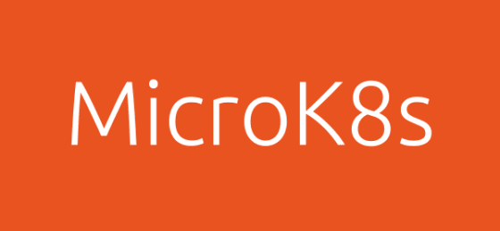

# MicroK8s actions




MicroK8s is Lightweight and pure upstream K8s.  The smallest, simplest, pure production K8s.  For clusters, laptops, IoT and Edge, on Intel and ARM.

This installs MicroK8s using Github Actions.  

More information about [MicroK8s](https://microk8s.io/)

This Github Action **only works on Linux machines.**

This Github Actions enables one to test their applications on multiple Kubernetes versions by following MicroK8s channels.

## Inputs

### `channel`

**Required**  This is the MicroK8s channel to choose.  Example: `latest/stable` or `1.18/stable` or `latest/edge/ha-preview` 

Strict confinement is also available [see](#strict-confinement)

### `addons`

New from `v0.2.0`

**Optional** a JSON array containing the MicroK8s addon to enable.  Example `addons: "['prometheus','metrics-server','linkerd']"`

### `rbac`

**Removed from `v0.3.0`**

**Deprecated in favor of the new argument `addons`**

**Optional**  Since MicroK8s does not enable `RBAC` by default, user can choose whether they want to enable rbac or not.

### `dns`

**Removed from `v0.3.0`**

**Deprecated in favor of the new argument `addons`**

**Optional**  Since MicroK8s does not enable `dns` by default, user can choose whether they want to enable CoreDNS or not.

### `storage`

**Removed from `v0.3.0`**

**Deprecated in favor of the new argument `addons`**

**Optional** Since MicroK8s does not enable `storage` by default, user can choose whether they want to enable local hostPath storage or not.

### `devMode`

New from `v0.3.0`


## Example Usage:

Below shows how one can use the Action.

```yaml
name: Test Microk8s
on: [push]

jobs:
  test:
    runs-on: ubuntu-latest
    name: A job to install MicroK8s
    steps:
    - uses: balchua/microk8s-actions@v0.3.0
      with:
        channel: '1.25/stable'
        addons: '["dns", "rbac", "hostpath-storage", "registry", "metrics-server"]'
    - name: Test MicroK8s
      id: myactions
      run: |
        kubectl get no
        kubectl get pods -A -o wide
        
```

To use `microk8s` commands for example: `microk8s status`, you should use `sudo` or `sg` command.

```yaml
    - name: Test MicroK8s commands
      id: microk8s
      run: |
        set -ex
        echo "Executing microk8s status using sg command."
        sg microk8s -c 'microk8s status'
        echo "Executing microk8s status using sudo command."
        sudo microk8s status
```

`sg` commands will execute the command using the group specified.  Description taken from [here](https://man7.org/linux/man-pages/man1/sg.1.html#:~:text=The%20sg%20command%20works%20similar,multi%2Dword%20commands%20in%20quotes.)

>  The sg command works similar to newgrp but accepts a command. The
   command will be executed with the /bin/sh shell. With most shells you
   may run sg from, you need to enclose multi-word commands in quotes.
   Another difference between newgrp and sg is that some shells treat
   newgrp specially, replacing themselves with a new instance of a shell
   that newgrp creates. This doesn't happen with sg, so upon exit from a
   sg command you are returned to your previous group ID.

## Strict confinement

From `v0.3.0` this action now supports Snap strict confinement.

**Please note that MicroK8s strict confinement is only available from `1.25` as a separate track `1.25-strict`.**

More information [here](https://ubuntu.com/blog/strictly-confined-microk8s)

``` yaml
jobs:
  test:
    runs-on: ubuntu-latest
    name: A job to install MicroK8s with strict confinement
    steps:
    - uses: balchua/microk8s-actions@v0.3.0
      with:
        channel: '1.25-strict/stable'
        devMode: 'true'
        addons: '["rbac", "dns", "hostpath-storage", "registry", "metrics-server"]'
```

## Kubeflow Addon

**Removed from `v0.3.0`, since it is no longer part of MicroK8s addon.**

You can use the `kubeflow` microk8s addon to test your ML.  Due to the size of the VM used by github actions the `KUBEFLOW_BUNDLE` used is `edge`.
This is the appropriate bundle for low resource machines.

For more information regarding kubeflow addon check this [link](https://microk8s.io/docs/addon-kubeflow)

## Building

The main program is a Typescript, located in [src/index.ts](src/index.ts).  Before pushing the code to Github, you should compile the source to ES6.

```shell
$ npm run build
```

